# 👨‍💻 Lucas Carvalho Steffens

### Software Engineer | Full Stack Developer

Desenvolvimento de software, APIs, sistemas web e soluções escaláveis.

  
  
  

---

## 🚀 Sobre mim

Sou **Engenheiro de Software** com experiência em desenvolvimento de aplicações, APIs REST, bancos de dados e infraestrutura.

Tenho foco em **Backend e Full Stack**, trabalhando com diferentes tecnologias para construir sistemas completos — desde a aplicação e banco de dados até **containers, CI/CD, monitoramento e deploy em Linux**.

Tenho experiência com projetos acadêmicos, profissionais e pessoais, buscando sempre aplicar boas práticas de **arquitetura, segurança, qualidade de código e automação**.

---

## 🛠️ Tech Stack

### Linguagens

  
  
  
  
  
  
  

### Backend & Frontend

  
  
  
  
  
  
  

### Database, DevOps & Tools

  
  
  
  
  
  
  
  

**Também:** REST APIs · JWT · Docker Compose · GitHub Actions · CI/CD · SonarCloud · Caddy · Gunicorn · SQL

---

## ⭐ Projeto em destaque

### 📈 InvestSmart

**Plataforma de análise fundamentalista e simulação de carteiras de investimentos.**

O InvestSmart é uma aplicação web completa desenvolvida com arquitetura separada entre frontend, backend e banco de dados.

**Principais recursos:**

* 📊 Análise fundamentalista
* 💰 Método de Barsi
* 📐 Método de Graham
* 📈 Projeção de investimentos
* 💼 Simulação e gerenciamento de carteiras
* 🔔 Sistema de alertas
* 🔐 Autenticação com JWT
* 🌐 API REST
* 📡 Integração com dados financeiros
* ⚙️ Jobs automatizados
* 📊 Prometheus & Grafana
* 🔒 HTTPS
* 🐳 Docker

**Stack:** React · Vite · Django REST Framework · PostgreSQL · Docker · Caddy · Prometheus · Grafana

---

## 📊 GitHub

---

## 📫 Contato

 

